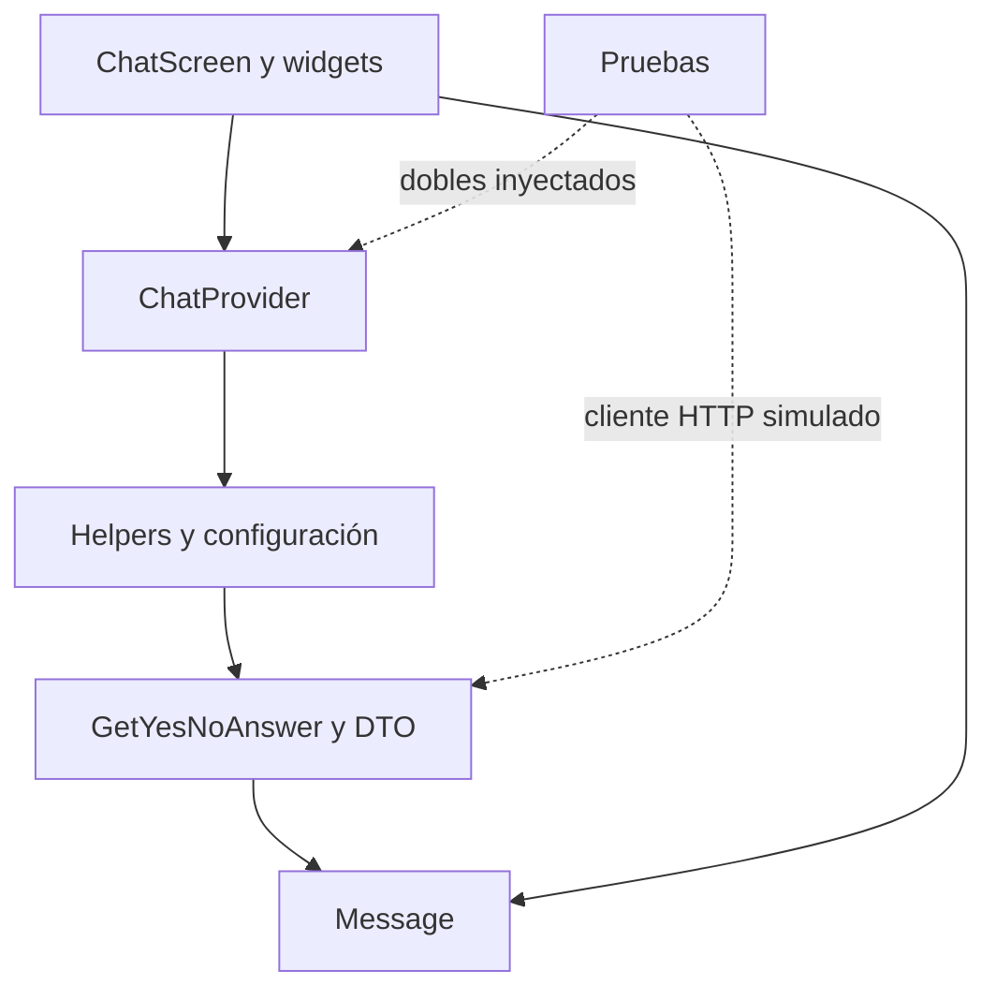

# Capas y dependencias

```mermaid
graph TD
  UI[ChatScreen y widgets] --> Provider[ChatProvider]
  Provider --> Config[Helpers y configuración]
  Config --> Infra[GetYesNoAnswer y DTO]
  Infra --> Domain[Message]
  UI --> Domain
  Tests[Pruebas] -. dobles inyectados .-> Provider
  Tests -. cliente HTTP simulado .-> Infra
```

El dominio contiene entidades Dart puras. Presentación, configuración e infraestructura dependen hacia el dominio; la entidad no conoce Flutter ni Dio.
