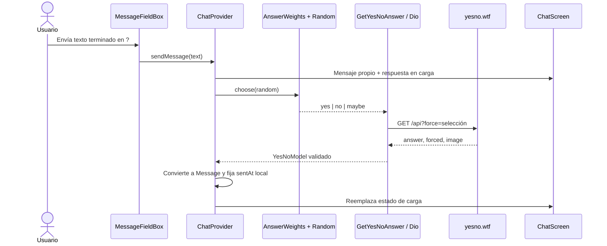

# Secuencia de pregunta

```mermaid
sequenceDiagram
  actor User as Usuario
  participant Field as MessageFieldBox
  participant State as ChatProvider
  participant Random as AnswerWeights + Random
  participant Api as GetYesNoAnswer / Dio
  participant Service as yesno.wtf
  participant View as ChatScreen
  User->>Field: Envía texto terminado en ?
  Field->>State: sendMessage(text)
  State->>View: Mensaje propio + respuesta en carga
  State->>Random: choose(random)
  Random-->>Api: yes | no | maybe
  Api->>Service: GET /api?force=selección
  Service-->>Api: answer, forced, image
  Api-->>State: YesNoModel validado
  State->>State: Convierte a Message y fija sentAt local
  State->>View: Reemplaza estado de carga
```
