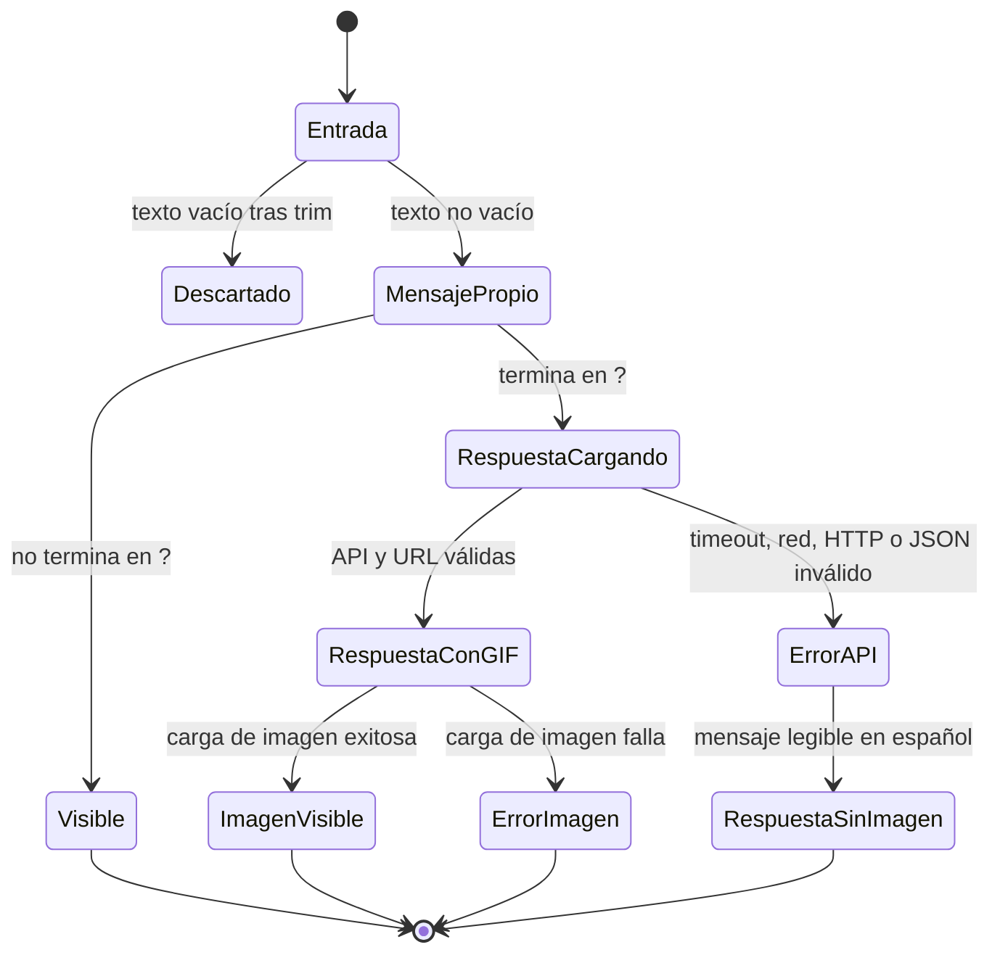

# Ciclo de vida del mensaje

```mermaid
stateDiagram-v2
  [*] --> Entrada
  Entrada --> Descartado: texto vacío tras trim
  Entrada --> MensajePropio: texto no vacío
  MensajePropio --> Visible: no termina en ?
  MensajePropio --> RespuestaCargando: termina en ?
  RespuestaCargando --> RespuestaConGIF: API y URL válidas
  RespuestaConGIF --> ImagenVisible: carga de imagen exitosa
  RespuestaConGIF --> ErrorImagen: carga de imagen falla
  RespuestaCargando --> ErrorAPI: timeout, red, HTTP o JSON inválido
  ErrorAPI --> RespuestaSinImagen: mensaje legible en español
  Visible --> [*]
  ImagenVisible --> [*]
  ErrorImagen --> [*]
  RespuestaSinImagen --> [*]
```
