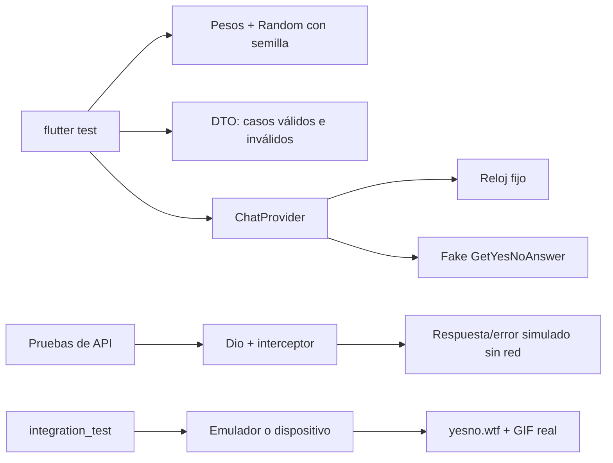

# Pruebas e inyección

```mermaid
graph LR
  Tests[flutter test] --> Weights[Pesos + Random con semilla]
  Tests --> Parser[DTO: casos válidos e inválidos]
  Tests --> Provider[ChatProvider]
  Provider --> Clock[Reloj fijo]
  Provider --> FakeApi[Fake GetYesNoAnswer]
  ServiceTests[Pruebas de API] --> Dio[Dio + interceptor]
  Dio --> NoNetwork[Respuesta/error simulado sin red]
  Integration[integration_test] --> Device[Emulador o dispositivo]
  Device --> Internet[yesno.wtf + GIF real]
```

Las pruebas unitarias y de widgets no necesitan red. Las de `integration_test` requieren dispositivo conectado e internet y se ejecutan por separado.
