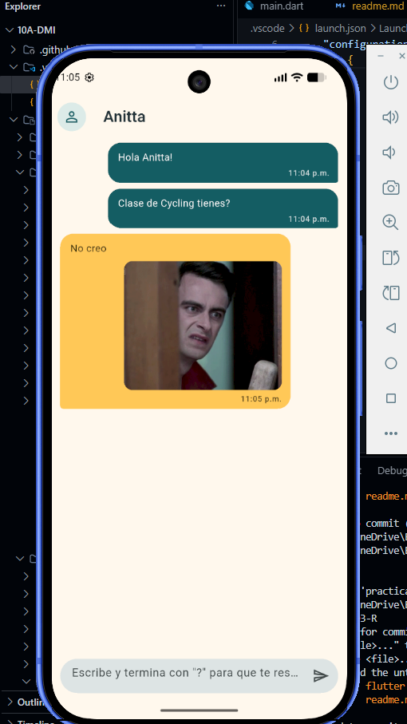
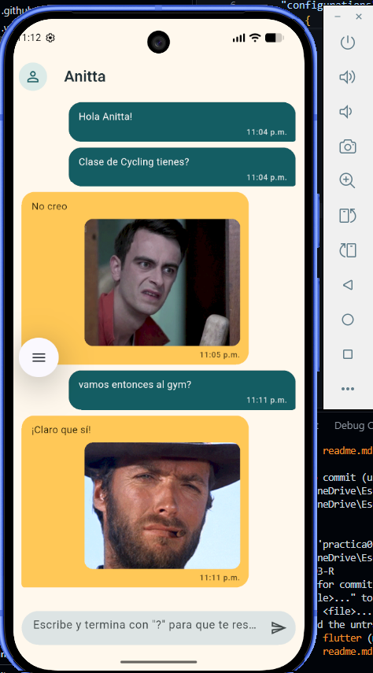

# Práctica 03 — Yes No Maybe App

> App de chat en Flutter que responde **Sí**, **No** o **Tal vez** a preguntas terminadas en `?`, consumiendo la API pública [yesno.wtf](https://yesno.wtf/).

- **Estudiante:** Angel de Jesus Baños Tellez
- **Matrícula:** 230592
- **Grupo:** 10A
- **Materia:** Desarrollo Móvil Integral (DMI)
- **Docente:** M.T.I. Marco A. Ramírez Hernández
- **Periodo:** Septiembre – Diciembre 2026

---

<p align="center">
  <a href="https://angeljdev.github.io/10A-DMI/practica-03/"><strong>🌐 Diagrama interactivo · GitHub Pages</strong></a>
</p>

## 1. Objetivo de la práctica

Construir una aplicación móvil con Flutter que consulte un servicio web externo, organice el código por capas, aplique inyección de dependencias y gestione errores tipados, acompañada por pruebas automatizadas y diagramas de arquitectura documentados.

### Objetivos específicos

1. Separar la lógica en las capas `domain`, `infrastructure`, `presentation` y `config`.
2. Desacoplar los datos del chat de Flutter mediante la entidad de dominio `Message`.
3. Manejar los errores de red y de formato mediante `YesNoException`.
4. Hacer testeable la lógica con inyección de `Dio`, `Random` y el reloj.
5. Verificar el comportamiento con pruebas unitarias, de widgets y de integración.

---

## 2. Tecnologías utilizadas

### Lenguajes y frameworks

| Tecnología | Versión | Uso en la práctica |
|---|---:|---|
| Flutter | 3.47.2 (stable) | Framework multiplataforma y Material 3. |
| Dart | 3.13.2 | Lenguaje de la aplicación, null safety y asincronía. |
| yesno.wtf | — | API REST que devuelve la respuesta (`yes`, `no` o `maybe`) y su GIF. |

### Paquetes de `pubspec.yaml`

| Paquete | Versión | Función dentro del proyecto |
|---|---:|---|
| `provider` | `^6.1.5+1` | Expone `ChatProvider` y actualiza el estado reactivo del chat. |
| `dio` | `^5.11.1` | Cliente HTTP, timeouts y errores `DioException`. |
| `cupertino_icons` | `^1.0.8` | Íconos con estilo iOS disponibles para la interfaz. |
| `flutter_lints` | `^6.0.0` | Reglas de calidad ejecutadas con `flutter analyze`. |
| `integration_test` | SDK Flutter | Pruebas end-to-end en emulador o dispositivo real. |

### Herramientas

| Herramienta | Uso |
|---|---|
| Android SDK + emulador | Ejecutar y comprobar la app en Android. |
| Visual Studio Code / Android Studio | Edición, depuración y hot reload. |
| Archify | Diagrama de arquitectura interactivo del proyecto. |
| Git + GitHub Pages | Versionado y publicación del portafolio. |

---

## 3. Funcionalidad

| Regla | Comportamiento |
|---|---|
| Disparo | Solo los mensajes cuyo texto recortado termina en `?` solicitan una respuesta. |
| Elección | Se sortean respuestas con pesos **40 % Sí / 40 % No / 20 % Tal vez**. |
| Texto y GIF | La API se consulta con `?force=<respuesta>` para recibir una respuesta congruente y su GIF. |
| Cola | Las preguntas se encadenan con `Future` para que las respuestas no se intercalen. |
| Hora | Cada burbuja muestra la hora local de envío en formato de 12 horas. |
| Errores | Los fallos de red, timeout o datos inválidos se muestran en español y sin imagen. |

---

## 4. Arquitectura por capas

```text
lib/
├── main.dart                               → Composition root con ChangeNotifierProvider
├── config/
│   ├── helpers/get_yes_no_answer.dart      → HTTP, pesos y traducción de errores
│   ├── helpers/format_time_of_day.dart     → Formato de la hora
│   └── theme/app_theme.dart                → Tema Material 3
├── domain/entities/message.dart            → Entidad pura del mensaje
├── infrastructure/models/yes_no_model.dart → DTO y validación de la API
└── presentation/
    ├── providers/chat_provider.dart        → Estado, cola y scroll del chat
    ├── screens/chat/chat_screen.dart       → Pantalla principal
    └── widgets/                            → Burbujas, campo y hora
```

La dependencia apunta hacia el dominio: `presentation → config / infrastructure → domain`. La entidad `Message` no depende de Flutter ni de Dio, por lo que puede probarse sin widgets ni red.

### Diagramas

- [Arquitectura interactiva (Archify)](https://angeljdev.github.io/10A-DMI/practica-03/)
- [Capas y dependencias](Docs/Architecture/01-layers.md)
- [Secuencia de pregunta y respuesta](Docs/Architecture/02-question-sequence.md)
- [Ciclo de vida del mensaje](Docs/Architecture/03-message-lifecycle.md)
- [Estrategia de pruebas e inyección](Docs/Architecture/04-testing.md)

---

## 5. Pruebas

| Archivo | Tipo | Casos verificados |
|---|---|---|
| `test/yes_no_service_test.dart` | Unitarias | Consulta forzada, error de conexión y payload inválido. |
| `test/widget_test.dart` | Unidad y widgets | Pesos, modelo, proveedor, interfaz, imagen y envío. |
| `integration_test/chat_flow_test.dart` | Integración | Mensajes simples, pregunta, GIF, respuesta y hora en dispositivo. |

- `flutter analyze lib test` → **sin incidencias**.
- `flutter test` → **18 pruebas aprobadas**.
- Las 2 pruebas de integración requieren emulador/dispositivo e internet.

```powershell
flutter analyze lib test
flutter test
flutter test integration_test/chat_flow_test.dart -d <device-id>
```

---

## 6. Ejecución

Desde la carpeta de esta práctica:

```powershell
flutter pub get
flutter run
```

La aplicación necesita internet para obtener el GIF de `yesno.wtf`. Los timeouts de conexión, envío y recepción están configurados a 10 segundos.

---

## 7. Decisiones de implementación

1. **Inyección por constructor.** `Dio`, `Random`, reloj y servicio se sustituyen por dobles en las pruebas.
2. **Respuesta controlada.** `AnswerWeights` decide la opción antes de llamar a `yesno.wtf` con `force`.
3. **Estado serializado.** `_answerQueue` evita carreras cuando el usuario envía varias preguntas.
4. **Errores localizados.** Los detalles técnicos se convierten en mensajes comprensibles para el usuario.
5. **Interfaz accesible.** El campo tiene etiqueta de envío, el chat conserva el foco y se desplaza al final.

---

## 8. Limitaciones

- La disponibilidad de respuestas y GIF depende del servicio externo `yesno.wtf` y de la conexión a internet.
- El avatar y el ícono del launcher permanecen con recursos neutros mientras no se proporcione una imagen personal para la aplicación.

---

## 9. Conclusiones

1. La arquitectura por capas permite separar interfaz, datos y reglas de negocio.
2. La inyección de dependencias hace posible probar la lógica sin usar red ni tiempo real.
3. La cola de `Future` conserva el orden entre preguntas y respuestas consecutivas.
4. `DioException` y errores de formato quedan encapsulados en un único error de dominio para la interfaz.
5. Las pruebas y los diagramas complementan el código con evidencia verificable del comportamiento de la app.

---

## 10. Evidencias de la aplicación

### Conversación inicial



### Respuesta de Anitta con GIF


