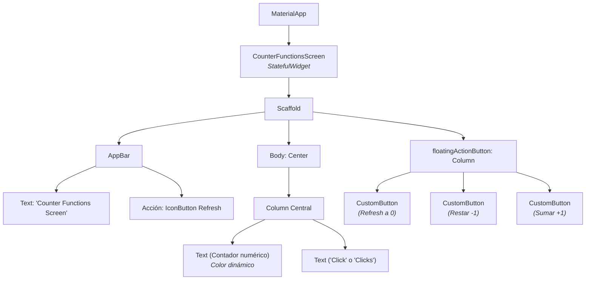
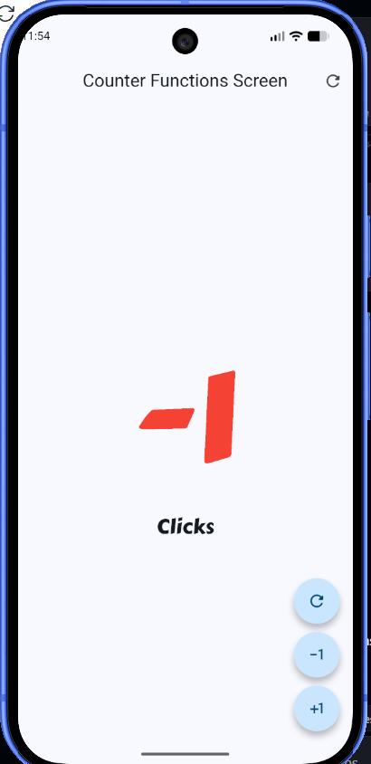
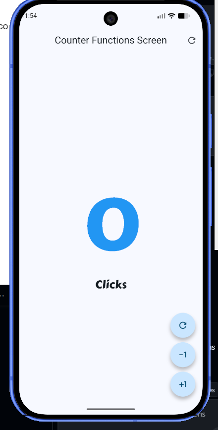
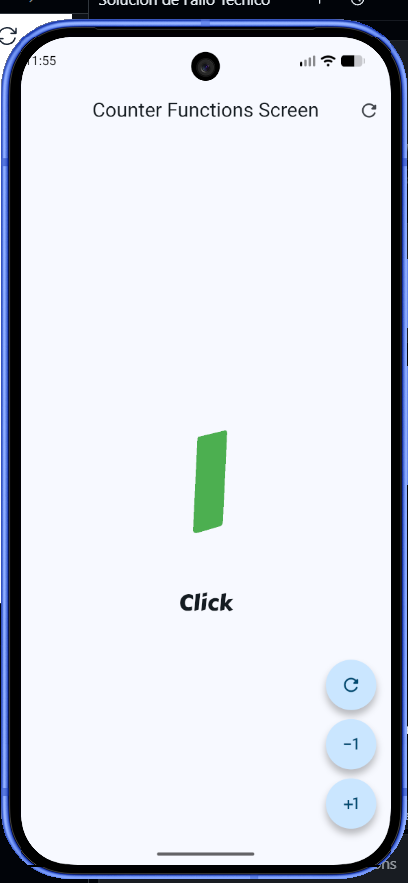

# Práctica 2: Mi Primer Aplicación Móvil con Flutter (Contador)

## Objetivo
Codificar una aplicación móvil en el framework de Flutter utilizando `Stateless` y `Stateful` widgets, implementando interactividad, componentes personalizados y estilos visuales dinámicos.

## Descripción de la Práctica
En esta práctica se desarrolló una aplicación de contador interactivo (`hello_world_app`). Los principales cambios y funcionalidades implementadas fueron los siguientes:

- **Contador Numérico:** Se implementaron las funciones lógicas para incrementar, decrementar (incluyendo números negativos) y reiniciar el contador a cero.
- **Colores Dinámicos:** El color del texto del número del contador cambia en base a su valor:
  - 🟢 **Verde:** Cuando el contador es mayor a 0.
  - 🔵 **Azul:** Cuando el contador es exactamente 0.
  - 🔴 **Rojo:** Cuando el contador baja a números negativos (< 0).
- **Fuentes Personalizadas:** Se integró el paquete `google_fonts` y se usó la fuente **Carter One** para darle una tipografía estilizada y gruesa a los textos de la interfaz.
- **Lógica de Pluralización:** El texto cambia automáticamente entre "Click" (cuando el contador es exactamente 1) y "Clicks" (para cualquier otro número).
- **Refactorización a Widgets Personalizados:** Se optimizó el código creando un componente propio reutilizable llamado `CustomButton`. Este widget envuelve a los `FloatingActionButton`, dándoles una forma circular (`StadiumBorder`) y recibiendo los iconos y acciones como parámetros para evitar repetir código.

## Diagrama de Arquitectura de UI

A continuación, se presenta un diagrama (generado con Mermaid) que muestra la jerarquía y estructura de los Widgets construidos en la aplicación:

## Enlace al Diagrama de Arquitectura
[Ver Diagrama de Arquitectura (Mermaid Live)](https://mermaid.live/edit#pako:eNqNVMtu2zAQ_BWCpzZgp-cWRYq2QA-F18C9S2EUW1xEJFImKddtEPjvXb2S0yZtUa8SZ2Z3Zoe7h1S3lGqm0X_T8o2Kih0zV26c6dlyQ1Uv_fLgU0sW81lM-iP4Xw4k8tVnN69XqP7W8kQ0C-fB1g7Fm8Dq4e365Qk3_mH-s308HhG2YjB6h2A-i1-Y7iU311o5Fk3Yf7-y-50Nn2B-i4G1wYlFm-DMIhZ5Y-aG7eJ2m7wZk2O-a0a1WjD6J4N3c5N96229oE7Gg3wH2tQZ7GZq8a4u6g_jMvjHq3w5i9c3pXgU-k2Z753wQ9G3Xl5n5O_p856ZpE7oO16sV5aY7bT5vX3D5Q-TzVj62Hh6J4o72yD3_mJ6K8z614K3K8lI42_J8N1aY9q5U59YhDk56zU9yR-u-c5E3fPZ5L_6J_y55g_3_H_wH4lV_B1P0fX6H8R1F2s)

*(Nota: GitHub y GitLab renderizan el bloque de código de arriba automáticamente. Si lo subes a un repositorio, el gráfico aparecerá solo).*

## Evidencias (Capturas de Pantalla)
A continuación, se muestran las diferentes facetas del contador funcionando con su respectiva lógica de color dinámico y pluralización:

### 1. Contador en 0 (Color Azul)

### 2. Contador Positivo (Color Verde)

### 3. Contador Negativo (Color Rojo)

---

## Arquitectura

La arquitectura representa la estructura y el funcionamiento principal de la aplicación Flutter.
Fue generada con **Archify** a partir de los componentes reales del proyecto.

## Arquitectura interactiva

La arquitectura representa la estructura y el funcionamiento principal de la aplicación Flutter.
Fue generada con **Archify** a partir de los componentes reales del proyecto.

[Ver arquitectura interactiva](https://angeljdev.github.io/10A-DMI/hello_world_app/)

## Tecnologías utilizadas

- Flutter
- Dart
- Material Design
- Architext
- Archify

## Resultado

La aplicación permite modificar el contador correctamente y muestra de forma visual su estado mediante colores y una tipografía personalizada, cumpliendo con los requisitos establecidos para la práctica.

---

## Enlace GitPages (Diagrama de Arquitectura)
[Ver Diagrama en GitHub Pages](https://angeljdev.github.io/10A-DMI/hello_world_app/)
*(Nota: Asegúrate de tener activado GitHub Pages en tu repositorio para que este enlace funcione correctamente).*
